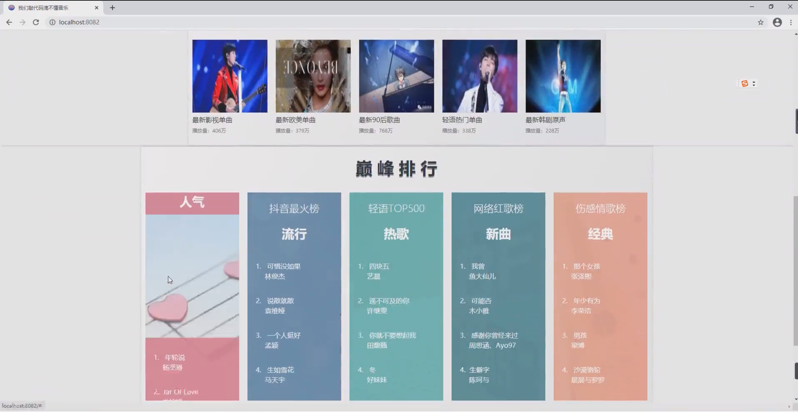
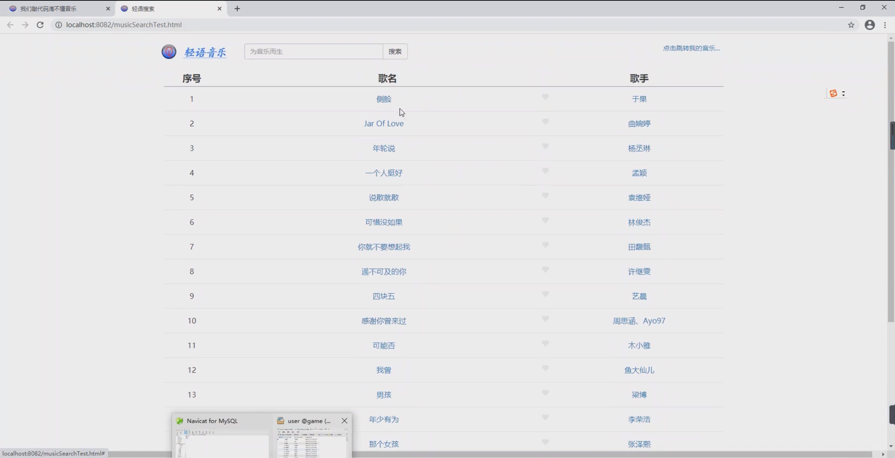
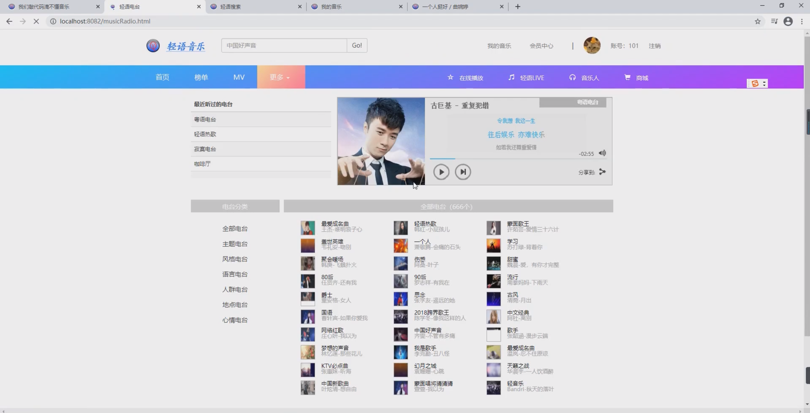

## 基于SpringBoot的轻语音乐网

- <b>完整代码获取地址：从戎源码网 ([https://armycodes.com/](https://armycodes.com/))</b>
- <b>技术探讨、资料分享，请加QQ群：692619798</b> 
- <b>作者微信：19941326836  QQ：952045282</b> 
- <b>承接计算机毕业设计、Java毕业设计、Python毕业设计、深度学习、机器学习</b>
- <b>选题+开题报告+任务书+程序定制+安装调试+论文+答辩ppt 一条龙服务</b>
- <b>所有选题地址 ([https://github.com/YuLin-Coder/AllProjectCatalog](https://github.com/YuLin-Coder/AllProjectCatalog)) </b>

## 项目介绍
基于SpringBoot的轻语音乐网
功能：
用户管理模块：用户登录、用户注册、修改密码
榜单列表模块：动态地从数据库中获取歌曲的链接和数据在榜单中显示
歌曲搜索模块：在首页的搜索框中可以输入关键字进行歌曲的模糊搜索
歌曲收藏模块：在榜单列表中或搜索页面中可以点击歌曲进行收藏
我的音乐模块：收藏的歌曲会被添加到我的音乐列表中，在我的音乐列表中也可以对歌曲进行删除操作
音乐播放器模块：在榜单、搜索页面和我的音乐列表等地方点击歌曲可以跳转到播放页面进行播放。播放页面显示
播放进度条，删除歌曲，暂停等操作。播放页面背景为模糊背景，根据歌手的专辑图片自动变化

## 项目技术
- 编程语言：Java
- 数据库：MySQL
- 项目管理工具：Maven
- 前端技术：HTML、CSS、JavaScript、Jquery、Ajax、Bootstrap
- 后端技术：Spring、SpringMVC、MyBatis

## 运行环境
- JDK版本：JDK1.8及以上
- 开发工具：IDEA、Ecplise、Myecplise都可以
- 数据库: MySQL5.7及以上
- Maven：maven3.0及以上

## 运行截图

